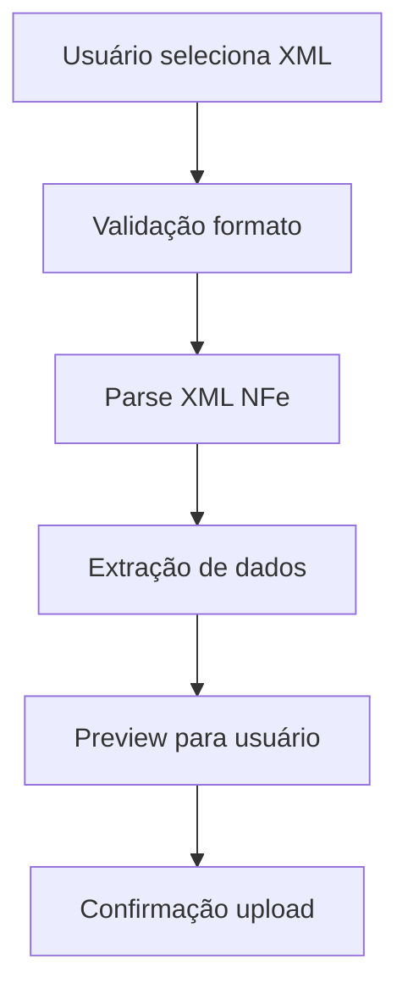
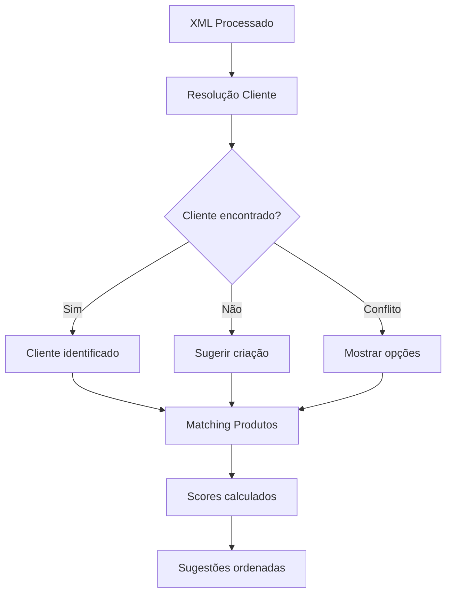
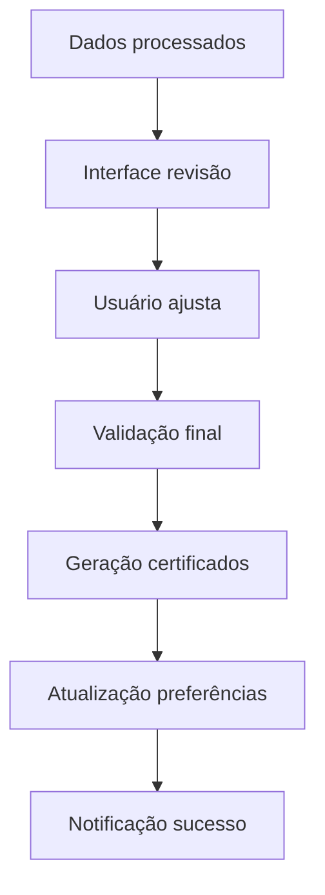

# 📄 Sistema de Importação NFe

Sistema completo para importação automática de Nota Fiscal Eletrônica (NFe) Modelo 55 e geração automatizada de certificados de saída para clientes nacionais.

## 🚀 Visão Geral

O Sistema de Importação NFe revoluciona o processo de emissão de certificados para clientes nacionais, transformando uma tarefa manual de horas em um processo automatizado de minutos.

### ✨ Principais Benefícios

- **⚡ Velocidade**: Redução de 95% no tempo de emissão de certificados
- **🎯 Precisão**: Eliminação de erros de digitação manual
- **🤖 Automação**: Cadastro automático de clientes e mapeamento de produtos
- **📊 Auditoria**: Rastro completo de todas as importações
- **🔄 Aprendizado**: Sistema melhora com o uso através de preferências de mapeamento

## 🏗️ Arquitetura do Sistema

### Componentes Backend

#### 1. Parser NFe XML (`nfe-xml-parser.ts`)
**Responsabilidade**: Extração estruturada de dados de arquivos XML NFe

```typescript
// Estruturas de dados extraídas
interface NFeData {
  invoice: NFeInvoiceData;     // Dados da nota fiscal
  emitente: NFeClientData;     // Dados do emitente
  destinatario: NFeClientData; // Dados do destinatário
  itens: NFeItemData[];        // Produtos da NFe
}
```

**Funcionalidades**:
- Suporte a diferentes versões e namespaces de NFe
- Validação automática de estrutura XML
- Extração de resumo para preview
- Tratamento de erros robusto

#### 2. Auto-Resolver de Clientes (`client-auto-resolver.ts`)
**Responsabilidade**: Detecção inteligente e criação automática de clientes

```typescript
interface ClientResolutionResult {
  action: 'found' | 'create' | 'conflict';
  client?: ClientData;
  conflicts?: ConflictData[];
  suggestedData?: ClientCreationData;
}
```

**Funcionalidades**:
- Busca exata por CNPJ/CPF
- Detecção de clientes similares com score de similaridade
- Tratamento de conflitos com opções manuais
- Geração automática de código interno
- Suporte a clientes nacionais e internacionais

#### 3. Matcher de Produtos (`product-item-matcher.ts`)
**Responsabilidade**: Correspondência inteligente entre itens NFe e produtos do sistema

```typescript
interface ProductMatch {
  similarity: number;          // Score 0-1
  matchReasons: string[];      // Razões da correspondência
  product: ProductData;        // Dados do produto
}
```

**Algoritmos de Matching**:
- **Correspondência exata**: Códigos idênticos (peso: 40%)
- **Similaridade de nomes**: Algoritmo Levenshtein (peso: 30%)
- **Unidades de medida**: Normalização e comparação (peso: 10%)
- **NCM**: Correspondência de classificação fiscal (peso: 5%)

### Componentes Frontend

#### 1. Formulário de Upload (`nfe-upload-form.tsx`)
**Funcionalidades**:
- Upload drag-and-drop
- Validação em tempo real de XML
- Preview automático de dados NFe
- Barra de progresso e feedback visual

#### 2. Interface de Revisão (`nfe-import-review.tsx`)
**Workflow em 3 abas**:
- **Cliente**: Resolução automática com override manual
- **Produtos**: Mapeamento com sugestões inteligentes
- **Resumo**: Confirmação final antes da importação

#### 3. Página Principal (`nfe-import-page.tsx`)
**Fluxo em 3 etapas**:
1. **Upload**: Seleção e validação do arquivo
2. **Revisão**: Verificação e ajustes dos dados
3. **Sucesso**: Confirmação e estatísticas da importação

## 📊 Endpoints da API

### `POST /api/nfe/validate`
**Função**: Validação prévia de arquivo XML NFe
```typescript
// Request
{
  xmlContent: string
}

// Response
{
  isValid: boolean;
  summary?: NFeSummary;
  errors: string[];
}
```

### `POST /api/nfe/upload`
**Função**: Upload e processamento completo de NFe
```typescript
// FormData com arquivo XML

// Response
{
  nfeData: NFeData;
  clientResolution: ClientResolutionResult;
  productMatches: ProductMatchResult[];
  stats: MatchingStats;
}
```

### `POST /api/nfe/import`
**Função**: Confirmação final e geração de certificados
```typescript
// Request
{
  nfeData: NFeData;
  clientId?: number;
  newClientData?: ClientData;
  productMappings: Record<string, number>;
}

// Response
{
  success: boolean;
  issuedCertificates: IssuedCertificate[];
  totalProcessed: number;
  errors: string[];
}
```

## 🗄️ Esquema de Banco de Dados

### Tabela `nfe_imports`
```sql
CREATE TABLE nfe_imports (
  id SERIAL PRIMARY KEY,
  tenant_id INTEGER NOT NULL REFERENCES tenants(id),
  nfe_number VARCHAR(50) NOT NULL,
  nfe_series VARCHAR(10) NOT NULL,
  issue_date DATE NOT NULL,
  client_id INTEGER REFERENCES clients(id),
  original_xml_file_url TEXT,
  import_status VARCHAR(20) NOT NULL DEFAULT 'pending',
  items_count INTEGER NOT NULL DEFAULT 0,
  processed_items_count INTEGER NOT NULL DEFAULT 0,
  error_message TEXT,
  created_at TIMESTAMP NOT NULL DEFAULT NOW(),
  created_by INTEGER NOT NULL REFERENCES users(id),
  processed_at TIMESTAMP
);
```

### Tabela `nfe_product_mappings`
```sql
CREATE TABLE nfe_product_mappings (
  id SERIAL PRIMARY KEY,
  tenant_id INTEGER NOT NULL REFERENCES tenants(id),
  nfe_product_code VARCHAR(100) NOT NULL,
  nfe_product_name VARCHAR(255) NOT NULL,
  system_product_id INTEGER NOT NULL REFERENCES products(id),
  mapping_confidence NUMERIC(3,2) NOT NULL DEFAULT 1.00,
  is_manual_mapping BOOLEAN NOT NULL DEFAULT false,
  created_at TIMESTAMP NOT NULL DEFAULT NOW(),
  updated_at TIMESTAMP NOT NULL DEFAULT NOW(),
  created_by INTEGER NOT NULL REFERENCES users(id)
);
```

## 🔧 Fluxo de Funcionamento

### 1. Upload e Validação


### 2. Processamento Automático


### 3. Revisão e Confirmação


## 💡 Casos de Uso Práticos

### Cenário 1: NFe com Cliente Conhecido
1. **Upload**: XML de cliente já cadastrado
2. **Processamento**: Cliente detectado automaticamente por CNPJ
3. **Produtos**: Matching automático com alta confiança
4. **Resultado**: Certificados gerados sem intervenção manual

### Cenário 2: NFe com Novo Cliente
1. **Upload**: XML de cliente não cadastrado
2. **Processamento**: Sistema sugere criação automática
3. **Revisão**: Usuário confirma dados do cliente
4. **Resultado**: Cliente criado + certificados gerados

### Cenário 3: NFe com Produtos Novos
1. **Upload**: XML com produtos não mapeados
2. **Processamento**: Sistema encontra produtos similares
3. **Revisão**: Usuário confirma mapeamentos
4. **Aprendizado**: Sistema salva preferências para futuras importações

## 📈 Métricas e Monitoramento

### Estatísticas de Importação
```typescript
interface ImportStats {
  totalItems: number;        // Total de itens na NFe
  exactMatches: number;      // Correspondências exatas
  goodMatches: number;       // Correspondências boa (>70%)
  needsReview: number;       // Requer revisão manual
  noMatches: number;         // Não encontrados
}
```

### Indicadores de Performance
- **Taxa de automação**: % de itens com matching automático
- **Tempo médio de processamento**: Do upload à geração de certificados
- **Taxa de erro**: % de importações com falhas
- **Precisão de matching**: Accuracy dos algoritmos de correspondência

## 🔒 Segurança e Validação

### Validação de Arquivos
- **Formato**: Verificação de estrutura XML válida
- **Tamanho**: Limite de 10MB por arquivo
- **Conteúdo**: Validação de elementos obrigatórios NFe
- **Malware**: Verificação de conteúdo malicioso

### Controle de Acesso
- **Feature Gate**: `certificates/create` necessário
- **Autenticação**: Usuário logado obrigatório
- **Tenant Isolation**: Dados isolados por tenant
- **Auditoria**: Log completo de todas as operações

### Tratamento de Erros
```typescript
// Categorias de erro
enum NFEErrorType {
  INVALID_XML = 'invalid_xml',
  MISSING_DATA = 'missing_data', 
  CLIENT_CONFLICT = 'client_conflict',
  PRODUCT_NOT_FOUND = 'product_not_found',
  CERTIFICATE_ERROR = 'certificate_error'
}
```

## 🚀 Roadmap de Melhorias

### Versão 2.0 (Próxima)
- [ ] **Importação em lote**: Múltiplos XMLs simultaneamente
- [ ] **Templates de mapeamento**: Configurações pré-definidas por cliente
- [ ] **API externa**: Webhook para sistemas ERP
- [ ] **Machine Learning**: Algoritmos adaptativos para matching

### Versão 2.1 (Futuro)
- [ ] **Suporte CTe**: Conhecimento de Transporte Eletrônico
- [ ] **Suporte MDFe**: Manifesto Eletrônico de Documentos Fiscais
- [ ] **Integração SEFAZ**: Consulta automática de NFes
- [ ] **OCR para PDFs**: Extração de dados de PDFs de NFe

## 📖 Exemplos de Implementação

### Uso Básico no Frontend
```tsx
import { NFeUploadForm } from '@/components/certificates/nfe-upload-form';
import { NFeImportReview } from '@/components/certificates/nfe-import-review';

// Página de importação completa
function NFEImportPage() {
  const [step, setStep] = useState('upload');
  const [importData, setImportData] = useState(null);

  return (
    <FeatureGate featurePath="certificates/create">
      {step === 'upload' && (
        <NFeUploadForm onSuccess={setImportData} />
      )}
      {step === 'review' && (
        <NFeImportReview 
          importData={importData}
          onConfirm={handleImport}
        />
      )}
    </FeatureGate>
  );
}
```

### Uso dos Serviços Backend
```typescript
// Parser NFe
const nfeData = await NFeXmlParser.parseNFeXml(xmlContent);

// Resolução de cliente
const clientResult = await ClientAutoResolver.resolveClient(
  nfeData.destinatario, 
  tenantId
);

// Matching de produtos
const productMatches = await ProductItemMatcher.bulkMatch(
  nfeData.itens, 
  tenantId
);
```

## 🤝 Contribuindo

### Melhorias no Algoritmo de Matching
- Implementar novos critérios de correspondência
- Otimizar performance para grandes catálogos
- Adicionar suporte a sinônimos e abreviações

### Extensões de Formato
- Suporte a outros tipos de documentos fiscais
- Integração com padrões internacionais
- Adaptação para diferentes países

### Interface do Usuário
- Melhorar experiência de revisão
- Adicionar visualizações de dados
- Implementar shortcuts de teclado

---

**Este sistema representa um marco na automação de processos para a indústria química brasileira, oferecendo eficiência sem precedentes na gestão de certificados de qualidade.**